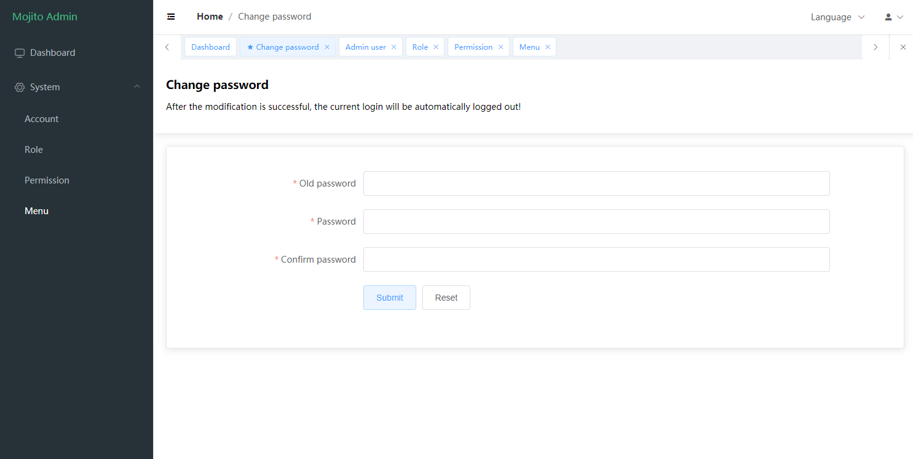

# 简介

Mojito Admin 是一个基于 Vue3、 Element Plus、Vite 构建的后台管理系统模板，开箱即用，无过度封装，也可以用于学习参考。

> mojito 3.0 版本开始， 已将原来的项目分离为两个代码库，分别为以Vue3、Element Plus、Vite 开发的前端模板 [mojito-admin](https://github.com/moell-peng/mojito-admin)  和服务端 [mojito](https://github.com/moell-peng/mojito) 。如果是需要使用 vue2 版本，请访问 [2.0](https://github.com/moell-peng/mojito/tree/2.0) 分支。

### 截图

## Demo

Mock 的数据，任意账号密码即可登录。[Demo](http://mojito.moell.cn/) 

## 特性

* 使用最新的Vue3、Vite2、Element Plus 等前端新技术开发
* 支持国际化
* Mock 内置模拟数据
* 灵活的权限判断
* 内置角色，权限，用户，菜单管理
* 多标签页
* 无过度封装
* 可选择基于 Laravel 开发的 [mojito](https://github.com/moell-peng/mojito.git) 后端配合使用

## License

Apache License Version 2.0 see http://www.apache.org/licenses/LICENSE-2.0.html

## 交流
QQ群：339803849

微信：扫码后拉入群(请说明来意)

  

